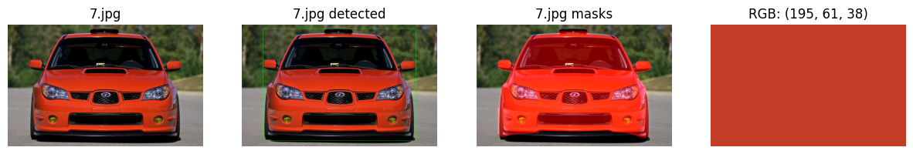
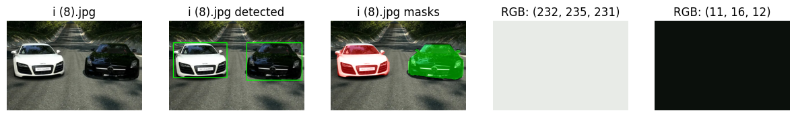

<h1> Определение цвета автомобилей по фотографии </h1>


<p align="left">
  <a href="https://github.com/svyatoslav-rozhdestvenskiy">
    
  </a>
  
  

## Постановка задачи

 У нас имеется фотография, на которой предположительно есть автомобили.

 Нам необходимо определить цвет каждого из них.

 ## Решение

 Решение представлено в ноутбуке car_color_ai.ipynb.

Примеры работы программы:





## Локальный запуск

1. Клонируйте репозиторий
```bash
git clone https://github.com/svyatoslav-rozhdestvenskiy/car_color_ai.git
```

2. Установите зависимости
```bash
pip install -r requirements.txt
```

3. Загрузите свои фотографии в [data](./data/)

4. Запустите ноутбук [car_color_ai.ipynb](./car_color_ai.ipynb)
